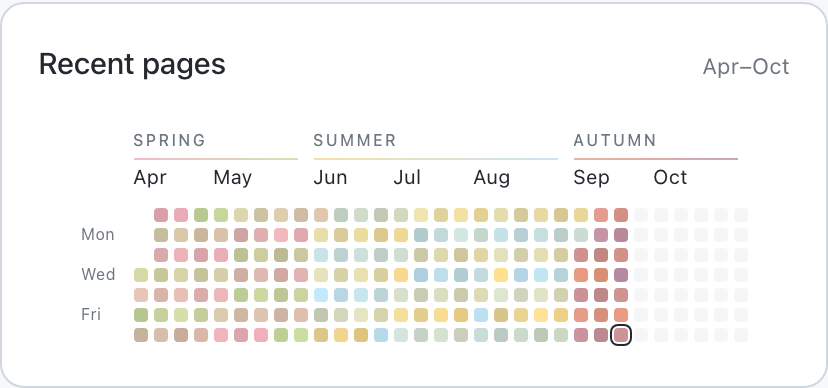

# Project Pothos

*Pothos (πόθος): longing or yearning. Here, a longing to feel whole.*

Some emotions can't be described with words but only with the colours of the changing seasons.

More to come.

## Feature highlight

### A history in colour

A diary-grid study: one square for each day, holding its chosen colour. A little patchwork of days to look back on.
